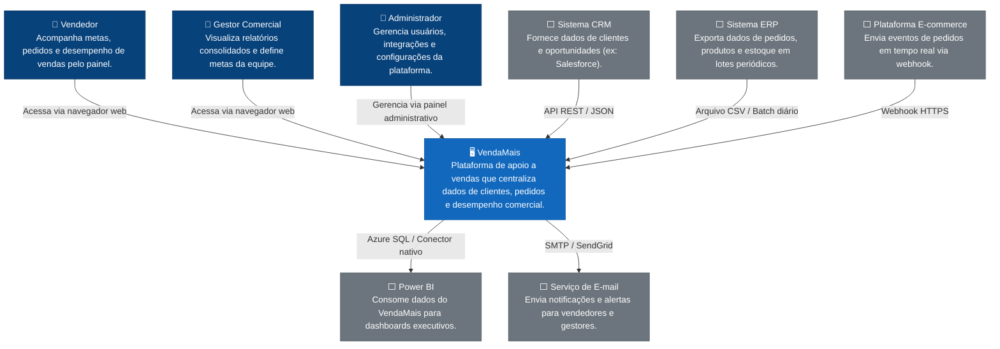

# C4 Nível 1 — Diagrama de Contexto

Este diagrama apresenta o sistema VendaMais em seu contexto, mostrando os usuários que interagem com ele e os sistemas externos com os quais se integra.

---  

---

## Descrição dos Elementos

### Usuários

| Ator | Descrição |
|---|---|
| **Vendedor** | Usuário principal da plataforma. Acompanha suas metas, carteira de clientes e pedidos em aberto. |
| **Gestor Comercial** | Visualiza o desempenho consolidado da equipe e define metas. |
| **Administrador** | Responsável por configurar integrações, usuários e permissões. |

### Sistemas Externos

| Sistema | Papel |
|---|---|
| **CRM (ex: Salesforce)** | Fonte de dados de clientes e oportunidades comerciais. |
| **ERP** | Fonte de dados de pedidos, produtos e estoque, enviados em lote. |
| **E-commerce** | Fonte de eventos de pedidos em tempo real via webhook. |
| **Power BI** | Consome os dados do VendaMais para relatórios executivos. |
| **Serviço de E-mail** | Canal de notificações e alertas da plataforma. |
