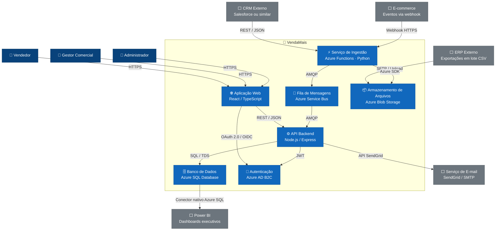

# C4 Nível 2 — Diagrama de Containers

Este diagrama decompõe o sistema VendaMais em seus containers principais, mostrando as tecnologias utilizadas e as responsabilidades de cada componente.

---  

--- 

## Descrição dos Containers

| Container | Tecnologia | Responsabilidade |
|---|---|---|
| **Aplicação Web** | React / TypeScript | Interface do usuário — dashboards, metas, pedidos e configurações. |
| **API Backend** | Node.js / Express | Regras de negócio, endpoints REST, orquestração entre serviços. |
| **Serviço de Ingestão** | Azure Functions (Python) | Recebe dados externos, normaliza e publica na fila. Acionado por eventos (HTTP, Timer, Queue). |
| **Fila de Mensagens** | Azure Service Bus | Desacopla ingestão e processamento, garantindo entrega confiável e resiliência. |
| **Banco de Dados** | Azure SQL Database | Persistência central de todos os dados relacionais da plataforma. |
| **Armazenamento de Arquivos** | Azure Blob Storage | Recebe arquivos CSV do ERP e armazena logs de processamento. |
| **Autenticação** | Azure AD B2C | Gerencia identidades, login, tokens JWT e controle de acesso. |
